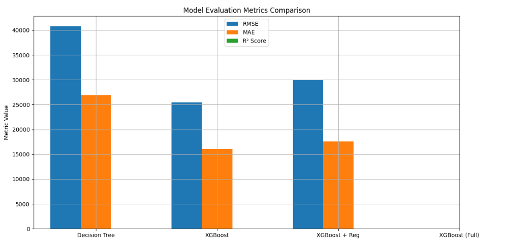

# House Price Prediction

A regression-based machine learning project aimed at predicting Ames housing sale prices using various models. This project was carried out as part of a Kaggle open data science competition.

---

### 🚧 Status: On Hold

---

## 🧠 Project Objective
The goal of this project is to build and evaluate multiple regression models to accurately predict the sale price of residential homes in Ames, Iowa. The dataset was obtained directly from Kaggle upon joining the competition.

---

## 👥 Partner
- Christopher Christian

---

## 🧪 Methodologies Used
- Inferential Statistics
- Machine Learning
- Data Visualization
- Predictive Modeling

---

## 💻 Technologies
- Python
- Jupyter Notebooks
- Pandas, NumPy
- Scikit-learn, XGBoost, KNN
- Matplotlib, Seaborn

---

## 📄 Project Description
This project explores and models the Ames housing dataset using a series of preprocessing and modeling steps:

- Extensive data visualization using Matplotlib and Seaborn to identify relationships between features.
- Scaling of continuous numerical features using **RobustScaler** to preserve outliers and reduce data loss.
- **One-Hot Encoding** for categorical features and **Label Encoding** for binary features.
- Model experimentation using multiple machine learning algorithms including **XGBoost**, **KNN**, **Decision Tree**, and **ElasticNet**.
- Due to the large number of features and a small team size, not all aspects of EDA were explored in depth.

---

## 📌 Project Requirements
- Data exploration / descriptive statistics
- Data preprocessing / cleaning
- Statistical modeling
- Reporting and write-up
- Thorough Exploratory Data Analysis (EDA)

---

## ⚙️ Installation & Setup Guide

1. **Clone the repository**:
```bash
git clone https://github.com/Eddythemachine/house_price_competition_kaggle.git
cd house_price_competition_kaggle
```

2. **Install dependencies**:
```bash
pip install -r requirements.txt
```

3. **Launch Jupyter Notebooks**:
```bash
jupyter notebook
```
Navigate to the `notebooks/` directory and run any notebook (e.g., `house_pricing_model.ipynb`).

---

## 🧾 Project Structure
```
house_price_competition_kaggle/
├── data/
│   ├── cleaned/
│   ├── feature_eng/
│   ├── raw/
│   └── submission/
├── models/
├── notebooks/
├── outputs/
├── scripts/
├── image.png
├── LICENSE
├── README.md
├── requirements.txt
```

**Folder Descriptions:**
- `data/`: Contains raw, cleaned, and feature-engineered datasets.
- `models/`: Serialized models (`.pkl`) for reuse.
- `notebooks/`: Jupyter notebooks for EDA, modeling, and dashboards.
- `outputs/`: Reports, metrics, and summaries.
- `scripts/`: Python scripts like `app.py` for automation or deployment.

---

## 📊 Model Performance
| Model                     | RMSE       | R² Score | MAE        |
|---------------------------|------------|-----------|------------|
| Decision Tree             | 40,780.62  | 0.7427    | 26,939.73  |
| XGBoost Base              | 25,422.12  | 0.9000    | 16,081.61  |
| XGBoost + Regularization  | 29,966.73  | 0.8611    | 17,574.41  |

---

## 🚀 Features
- Train/test split and cross-validation
- Multiple model training and performance comparison
- Automated hyperparameter tuning with GridSearchCV
- Model evaluation using RMSE, MAE, and R²
- CSV prediction submission file generation
- Model persistence using Pickle

---

## 🖼️ Demo


---

## 📬 Contact
Feel free to raise issues or contribute to the repository. For direct inquiries, you can reach out via GitHub or email.

---

**Maintained by**: Onayifeke Edison

